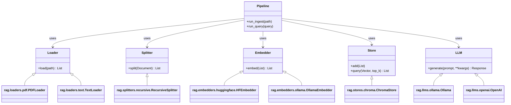
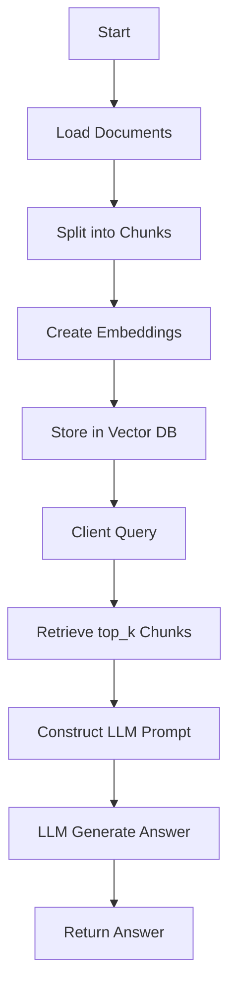
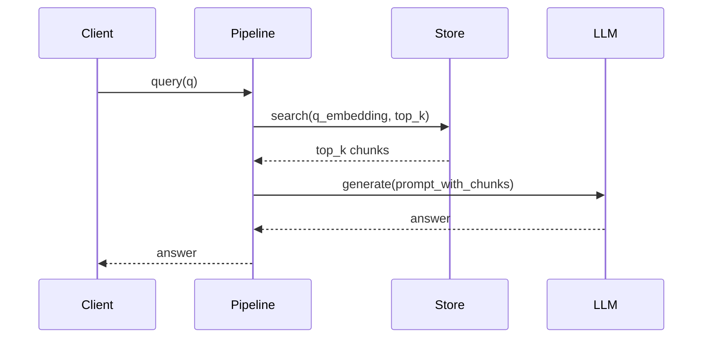

# rag_v3

## Project Purpose

Repo contains a small RAG framework:
- Ingest documents (`loaders/`)
- Split into chunks (`splitters/`)
- Embed chunks (`embedders/`)
- Store/retrieve vectors (`stores/`)
- Orchestrate retrieval + LLM calls (`core/pipeline.py`)
- Provide provider-specific LLM adapters (`llms/`)

## File Map (important files)
- [rag/__main__.py](rag/__main__.py) — CLI entrypoint
- [rag/config.py](rag/config.py) — config loader & defaults
- [rag/core/pipeline.py](rag/core/pipeline.py) — main pipeline orchestration
- [rag/core/protocols.py](rag/core/protocols.py) — type protocols/interfaces
- [rag/embedders](rag/embedders) — embedder implementations
- [rag/llms](rag/llms) — LLM provider adapters
- [rag/loaders](rag/loaders) — document loaders (pdf, text)
- [rag/splitters](rag/splitters) — chunking logic
- [rag/stores](rag/stores) — vector DB integrations (chroma)

## Architecture Overview

- The entrypoint loads configuration, prepares the pipeline, and executes ingestion or query flows.
- Each subsystem provides a small interface (protocols) so components are swappable.

## Class Diagram (Mermaid)



## Pipeline Flowchart (Mermaid)



## Sequence Diagram: Query



## Config Example (nested TOML)

The project uses `rag.toml` with nested tables. Example structure produced in this repo:

```toml
[rag.chunking]
chunk_size = 1000
chunk_overlap = 100

[rag.storage]
collection_name = "rag_docs"
vector_db_dir = "corpus/vector_db"

[rag.embedder]
type = "huggingface"
model = "all-MiniLM-L6-v2"

[rag.llm]
provider = "ollama"
model = "llama3.2:3b"
temperature = 0.1

[rag.retrieval]
top_k = 5

[rag.infrastructure]
ollama_host = "http://localhost:11434"
```

## Quickstart

1. Create a virtualenv and install (editable):

```bash
python -m venv .venv
source .venv/bin/activate
pip install -e .
```

2. Run tests:

```bash
pytest -q
```

3. Run CLI (example):

```bash
python -m rag --help
# or run an ingest
python -m rag ingest /path/to/docs
# or query
python -m rag query "What is ...?"
```

## How to read the code

- Start at [rag/__main__.py](rag/__main__.py) to see CLI wiring.
- Inspect [rag/core/pipeline.py](rag/core/pipeline.py) for the main high-level flow.
- Look at [rag/core/protocols.py](rag/core/protocols.py) to understand interfaces you can implement.

