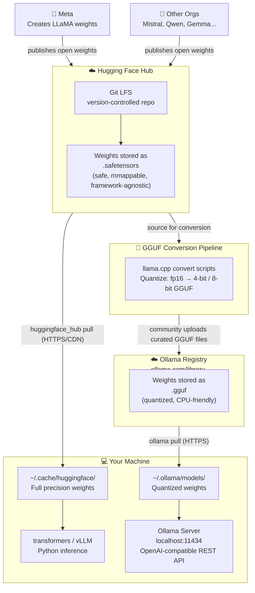

- Two paths from HF Hub: full precision to `~/.cache/huggingface/`, or quantized (GGUF) to `~/.ollama/models/`.
- GGUF conversion is a community step — not automated by HF or Ollama.
- Ollama's registry is a curated GGUF mirror; original weights live on HF.

---

## Hugging Face

**GitHub + PyPI for ML** — hosts models, datasets, and demo apps. Models live in Git LFS repos; you pull them with `huggingface_hub` / `transformers`. Weights are `.safetensors` or `.bin`. Two-way registry — you can publish your own models.

## Ollama

**Docker for LLMs** — downloads, runs, and serves models locally. Runs a server on `localhost:11434` with an OpenAI-compatible REST API. Uses **GGUF** (quantized via `llama.cpp`) — a 7B model shrinks from ~14 GB to ~4 GB at 4-bit, runnable on CPU alone.

## Side-by-side

|  | Hugging Face | Ollama |
|---|---|---|
| **Analogy** | GitHub + PyPI for ML | Docker for LLMs |
| **Primary use** | Training, fine-tuning, research | Local inference |
| **Format** | safetensors (fp16/bf16) | GGUF (quantized) |
| **Interface** | Python library | CLI + REST API |
| **Cache** | `~/.cache/huggingface/` | `~/.ollama/models/` |
| **Publish models?** | Yes | No |

HF is where the research happens; Ollama is how you run it locally.

---

## Safetensors

HF's replacement for pickle-based `.bin` files. PyTorch's `torch.load()` executes arbitrary Python on deserialize — a supply chain risk. Safetensors is a **pure data format**: 8-byte header size + JSON metadata + raw tensor bytes. No code execution possible.

Key benefits: memory-mappable (load only the tensors you need), framework-agnostic (PyTorch/TF/JAX/NumPy), 2–3× faster loads than pickle.

---

## Meta vs Ollama

**Meta** made **LLaMA** (the model family). **Ollama** (founded by Jeffrey Morgan and Michael Chiang) is the runtime — no affiliation with Meta. The name is "ol' llama," a nod to LLaMA being its primary model at launch. Same relationship as Docker and Linux.

---

## How this maps to `rag.toml`

`[rag.embedder] type` selects the provider used for **both** ingest and query
(they must match, or query vectors won't align with stored vectors):

| `type`        | Class                   | Install          | Notes                        |
|---------------|-------------------------|------------------|------------------------------|
| `huggingface` | `HuggingFaceEmbeddings` | `--extra hf`     | Local sentence-transformers  |
| `ollama`      | `OllamaEmbeddings`      | `--extra ollama` | Needs Ollama running locally |

`build_embedder()` in `ingest.py` and `query.py` reads this field. Switching
providers requires re-ingesting, since the two produce incompatible vectors.
