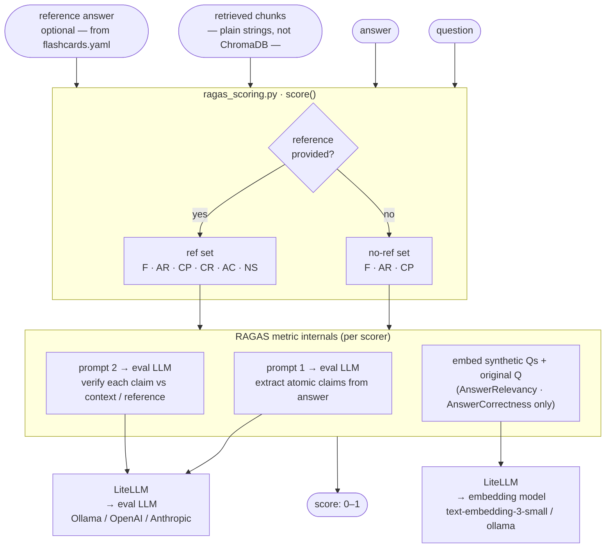
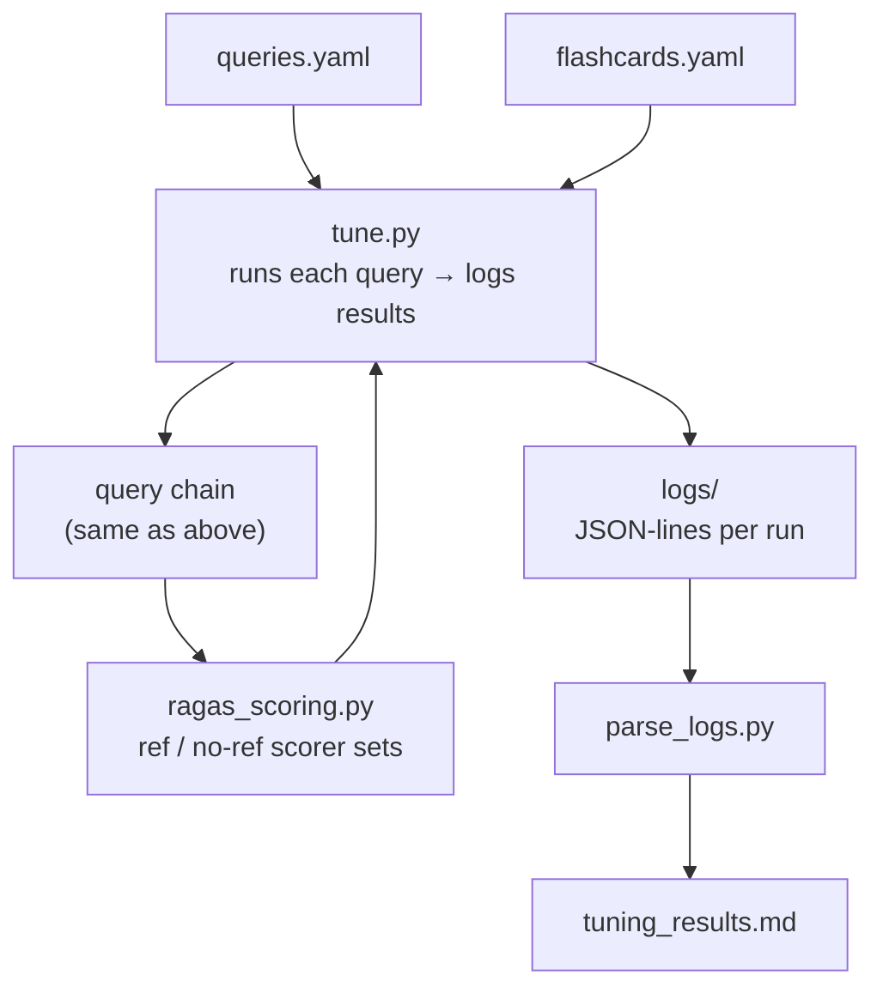
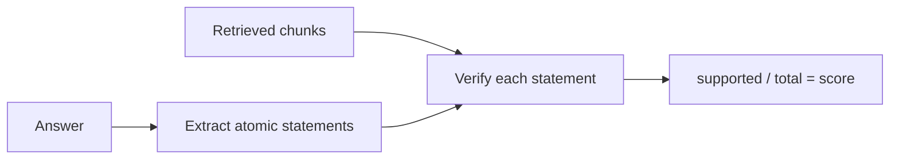
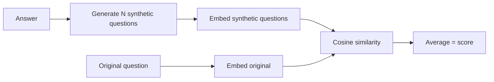
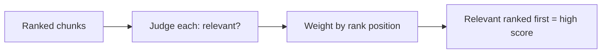
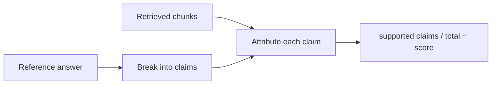
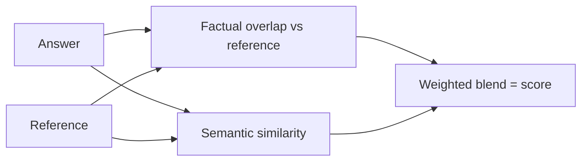
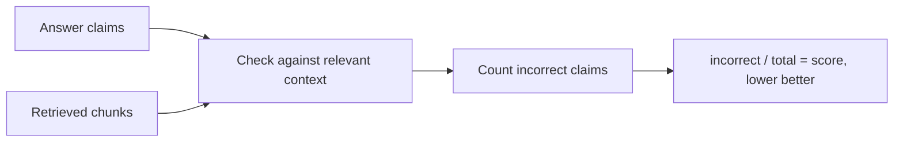

# RAG Tuning Metrics Intuition

RAG metrics measure whether the pipeline is retrieving the right information and generating grounded, accurate answers — catching failures that standard accuracy scores miss, like hallucination, noisy retrieval, and off-topic responses.

The metrics indicate whether the answer is founded. If the answer is not sourced from the corpus, then it is unfounded.

---

## How RAGAS works

RAGAS is an **LLM-as-judge** evaluation library. Rather than comparing answers against a fixed answer key with string matching, it uses a second LLM (the "eval LLM") to assess quality. This means it can evaluate free-form generated text that would score poorly under rigid rules, and it can do so without human annotation for most metrics. The tradeoff is that each scored answer costs additional LLM API calls, and a weak eval model will produce unreliable scores — which is why this project recommends setting a capable model under `[rag.evaluation]` in `rag.toml`.

Each RAGAS metric runs a small multi-step prompt chain. Faithfulness, for example, works in two calls: first the eval LLM extracts all atomic claims from the answer ("Einstein was born in Germany on 14 March 1879" → two claims), then a second call checks each claim against the retrieved context chunks to determine if it is inferable. The final score is `supported_claims / total_claims`. Other metrics follow similar decompose-then-verify patterns. Answer Relevancy is different — it generates synthetic questions that the answer could plausibly address, then computes cosine similarity between those synthetic questions and the original question using an embedding model. Metrics that require a reference (Context Recall, Answer Correctness, Noise Sensitivity) add the ground-truth answer as an additional input to the same kind of prompt chains.

RAGAS is a **post-hoc scorer** — it never queries ChromaDB or the query chain. It receives the question, answer, and retrieved chunks as plain strings that were already collected during the tune run. The only external services RAGAS calls are the eval LLM and optionally an embedding model, both routed through LiteLLM. This means RAGAS is completely decoupled from the retrieval system; it evaluates outputs, not the system that produced them.

## RAGAS internal flow

## Evaluation pipeline

Queries without a `reference` field use the **no-ref scorer set** (Faithfulness, Answer Relevancy, Context Precision).  
Queries with a `reference` use the **ref scorer set** (adds Context Recall, Answer Correctness, Noise Sensitivity).

---

## faithfulness

**What it checks:** Is the answer grounded in what was retrieved?

**How it works:** The judge LLM breaks the generated answer into atomic statements, then verifies each statement against the retrieved chunks. The score is the fraction of statements that are supported.

---

## answer relevancy

**What it checks:** Is the answer focused and on point?

**How it works:** The LLM is prompted to generate several questions that the answer could plausibly answer. Each synthetic question is embedded and compared to the original question via cosine similarity, and the scores are averaged. A diffuse or off-topic answer produces questions that diverge from the original.

---

## context precision

**What it checks:** Are the relevant chunks ranked at the top?

**How it works:** Each retrieved chunk is judged relevant or not, then a weighted average rewards relevant chunks that appear earlier in the ranking. The score is high when answer-supporting chunks come before noise chunks. Poor embeddings or oversized chunks drag this down.

---

## context recall *(reference required)*

**What it checks:** Did retrieval find everything the answer needs?

**How it works:** The reference answer is broken into claims, and each claim is checked to see whether it can be attributed to the retrieved chunks. The score is the fraction of reference claims supported by retrieval. If the corpus has the right info but retrieval misses it, this drops.

---

## answer correctness *(reference required)*

**What it checks:** Is the generated answer factually correct versus the reference?

**How it works:** Combines factual overlap (true/false positives and negatives between answer and reference statements) with embedding semantic similarity, then blends them into a single score. Measures how closely the generated answer matches the ground truth.

---

## noise sensitivity *(reference required)*

**What it checks:** Does the LLM hallucinate even when good context was retrieved? (Lower is better.)

**How it works:** Examines claims in the answer and counts how many are incorrect despite relevant context being present in the retrieved chunks. This isolates generation-side errors from retrieval-side errors.

---

# Chunk size & overlap at the extremes

How each metric degrades when chunk size or overlap is pushed too far in either direction.

## faithfulness

- *Chunks too large:* the relevant evidence may not be retrieved at all (its embedding is diluted by surrounding noise), so statements lose their support and the score falls.
- *Chunks too small:* a single fact's supporting evidence gets split across boundaries, so no one retrieved chunk fully backs the statement.
- *Overlap too low:* facts straddling a boundary are severed, leaving statements unsupported.
- *Overlap too high:* near-duplicate chunks crowd the top-k and push the actual supporting chunk out of the retrieval window.

## answer relevancy

- *Chunks too large:* the answer gets padded with tangential material from the oversized chunk, becoming diffuse, so the synthetic questions scatter away from the original.
- *Chunks too small:* fragmented context yields vague or incomplete answers, again widening the question spread.
- *Overlap too low:* split context produces partial answers that drift off-topic.
- *Overlap too high:* redundant chunks add little new signal, so wasted retrieval slots starve the answer of focused content.

## context precision

- *Chunks too large:* every chunk mixes signal with noise, so its embedding is muddied and clean ranking becomes impossible — relevant and irrelevant chunks look alike.
- *Chunks too small:* relevant evidence is scattered across many fragments, letting noise fragments rank above the ones that matter.
- *Overlap too low:* boundary-split relevant content is under-represented and ranked lower.
- *Overlap too high:* near-duplicate chunks flood the top ranks, reducing diversity and demoting genuinely relevant material.

## context recall *(reference required)*

- *Chunks too large:* dilution can keep the one chunk holding a reference claim from being retrieved, so that claim goes unsupported.
- *Chunks too small:* reference claims spread across many fragments that a fixed top-k cannot all capture, leaving gaps.
- *Overlap too low:* a claim spanning a boundary is lost from both chunks, so neither covers it.
- *Overlap too high:* duplicate chunks consume top-k slots, leaving fewer unique chunks and missed reference claims.

## answer correctness *(reference required)*

This metric inherits retrieval quality, so anything that hurts precision or recall hurts it too.

- *Chunks too large:* noise bundled into context leads the answer to assert wrong details (false positives), lowering factual overlap.
- *Chunks too small:* missing context yields incomplete answers (false negatives) that omit reference facts.
- *Overlap too low:* boundary-split evidence produces partial, drifting answers.
- *Overlap too high:* redundant retrieval starves the answer of the full set of facts needed to match the reference.

## noise sensitivity *(reference required, higher = worse)*

- *Chunks too large:* bundling tangential or even contradictory text alongside the relevant passage tempts the LLM into wrong claims, raising the score.
- *Chunks too small:* fragmented context leaves gaps the LLM fills by guessing, introducing incorrect claims.
- *Overlap too low:* severed context forces the model to improvise across the missing boundary.
- *Overlap too high:* duplicated passages over-emphasize certain text and can mislead the model into spurious assertions.

---

# Huge thing

The embedding model quality often matters MORE than the LLM for RAG quality.

Bad retrieval = bad answers.

Watch for:

- bad chunking
- weak embeddings
- wrong top-k
- noisy documents
- overlap settings
- retrieval strategy

I param swept chunking and overlap, and I don't think anything else. I have top-k as a param that I can set in config.

---

# Hyperparam grid results

Best results:

1. chunk_size_500_chunk_overlap_300
2. chunk_size_1000_chunk_overlap_100

If I used a weighted approach, faithfulness would be given more weight than other metrics.

| collection                            | faithfulness_mean     | answer_relevancy_mean | context_precision_mean | context_recall_mean   | answer_correctness_mean | 1 − noise_sensitivity_mean | average               |
| ------------------------------------- | --------------------- | --------------------- | ---------------------- | --------------------- | ----------------------- | -------------------------- | --------------------- |
| **chunk_size_1000_chunk_overlap_100** | **0.788635596082405** | **0.759354347045559** | **0.513935307285082**  | **0.782608695652174** | **0.485039868968765**   | **0.669565217391304**      | **0.666523172190696** |
| **chunk_size_500_chunk_overlap_300**  | **0.784441137566138** | **0.792516239352062** | **0.580958477289089**  | **0.836956521739131** | **0.493999915844506**   | **0.757142857142857**      | **0.707669191488964** |
| chunk_size_1000_chunk_overlap_50      | 0.757936507936508     | 0.686146318485333     | 0.488025398347912      | 0.739130434782609     | 0.470100674053191       | 0.655421450530146          | 0.632793464022617     |
| chunk_size_2000_chunk_overlap_50      | 0.753145743145743     | 0.659794469826173     | 0.477829093825789      | 0.834239130434783     | 0.479208844712188       | 0.663588263588264          | 0.647967590922157     |
| chunk_size_1000_chunk_overlap_300     | 0.751992753623188     | 0.732942210594146     | 0.542720063250153      | 0.802536231884058     | 0.506924924597214       | 0.646228031228031          | 0.663890702529017     |
| chunk_size_2000_chunk_overlap_200     | 0.750672877846791     | 0.685848681442791     | 0.578543424252831      | 0.855978260869565     | 0.474881695484630       | 0.643518739714392          | 0.664845372215        |
| chunk_size_500_chunk_overlap_100      | 0.742162698412698     | 0.751647280439849     | 0.556768319452558      | 0.779895507246377     | 0.438585491930068       | 0.725396825396825          | 0.665576020479733     |
| chunk_size_2000_chunk_overlap_300     | 0.739855072463768     | 0.666771212033607     | 0.489694022147018      | 0.877717391304348     | 0.481392346300923       | 0.649284953294853          | 0.649787482924086     |
| chunk_size_1000_chunk_overlap_200     | 0.735207700101317     | 0.711844185292747     | 0.466802528250216      | 0.802536231884058     | 0.480014818879666       | 0.676143029675638          | 0.645424749013940     |
| chunk_size_3000_chunk_overlap_100     | 0.732910052910053     | 0.680336576482432     | 0.577609036978801      | 0.805253623188406     | 0.469337927587673       | 0.646280591389287          | 0.651954634756109     |
| chunk_size_3000_chunk_overlap_200     | 0.730615942028986     | 0.653545108051551     | 0.484857833138261      | 0.834239130434783     | 0.493069099088755       | 0.691398108064775          | 0.640083570134519     |
| chunk_size_3000_chunk_overlap_50      | 0.722214922758401     | 0.675048963952095     | 0.554240359577647      | 0.848731884057971     | 0.482749187105369       | 0.656109108283021          | 0.656151573762256     |
| chunk_size_500_chunk_overlap_300      | 0.720887445887446     | 0.688497056789195     | 0.501550038930691      | 0.822336956521739     | 0.453395493974838       | 0.649240855762595          | 0.652916650344276     |
| chunk_size_3000_chunk_overlap_300     | 0.6921875             | 0.685970851122195     | 0.586207566528496      | 0.790608695652174     | 0.454416760763144       | 0.676477146042363          | 0.647601115670236     |
| chunk_size_500_chunk_overlap_50       | 0.663753799392097     | 0.688813538011502     | 0.533013507722147      | 0.713768115942029     | 0.410203425059683       | 0.721851276742581          | 0.621900610478340     |
| chunk_size_500_chunk_overlap_200      | 0.389326394645544     | 0.401606153259400     | 0.286124878509655      | 0.460144927536232     | 0.247200365195387       | 0.918526099504360          | 0.450488136441763     |
