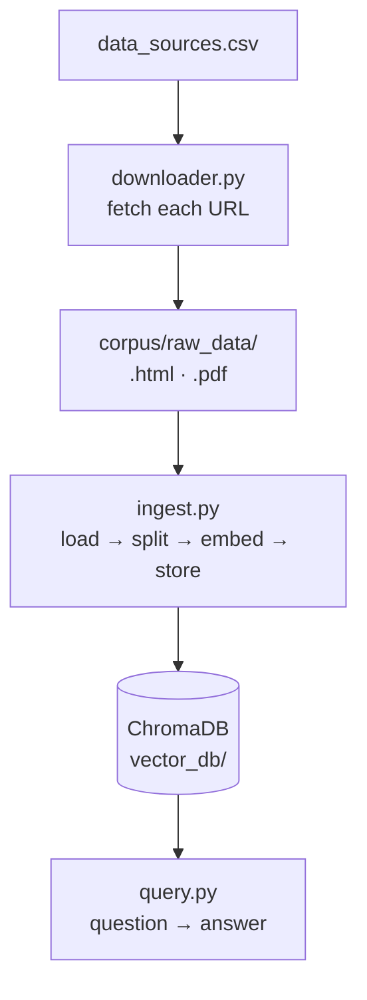
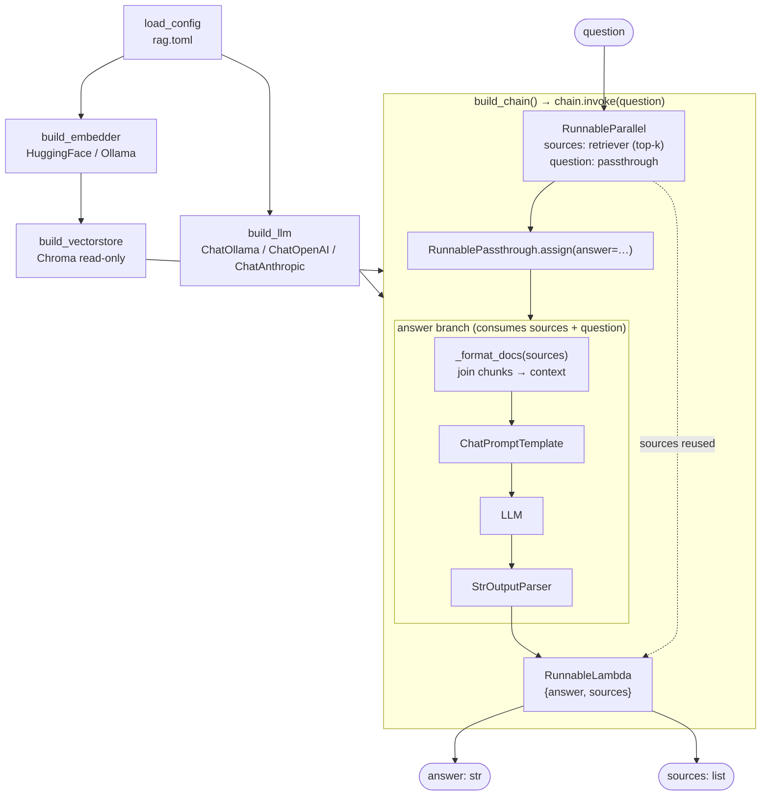

# RAG Pipeline

## Full Pipeline



## Generalized lifecycle

### Ingest

```
documents > chunking > embedding model > vectors > stored in Chroma
```

### query

```
question > same embedding model > query vector > nearest chunks from Chroma > LLM prompt > answer
```

## query.py Internal Flow — LCEL



