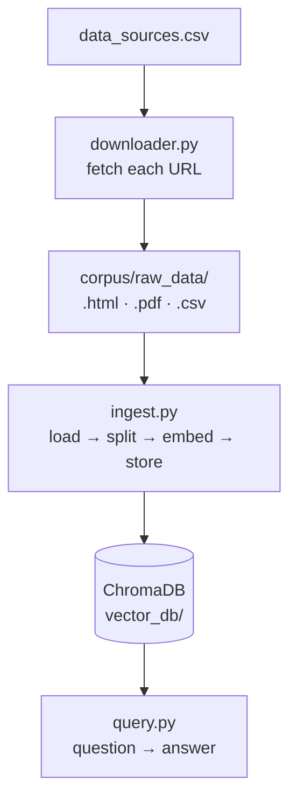
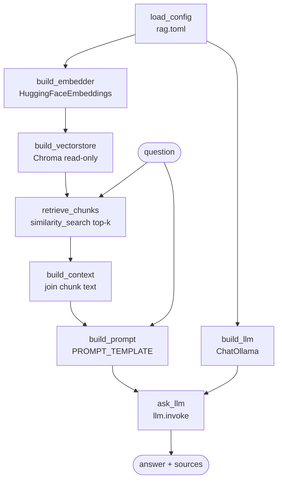
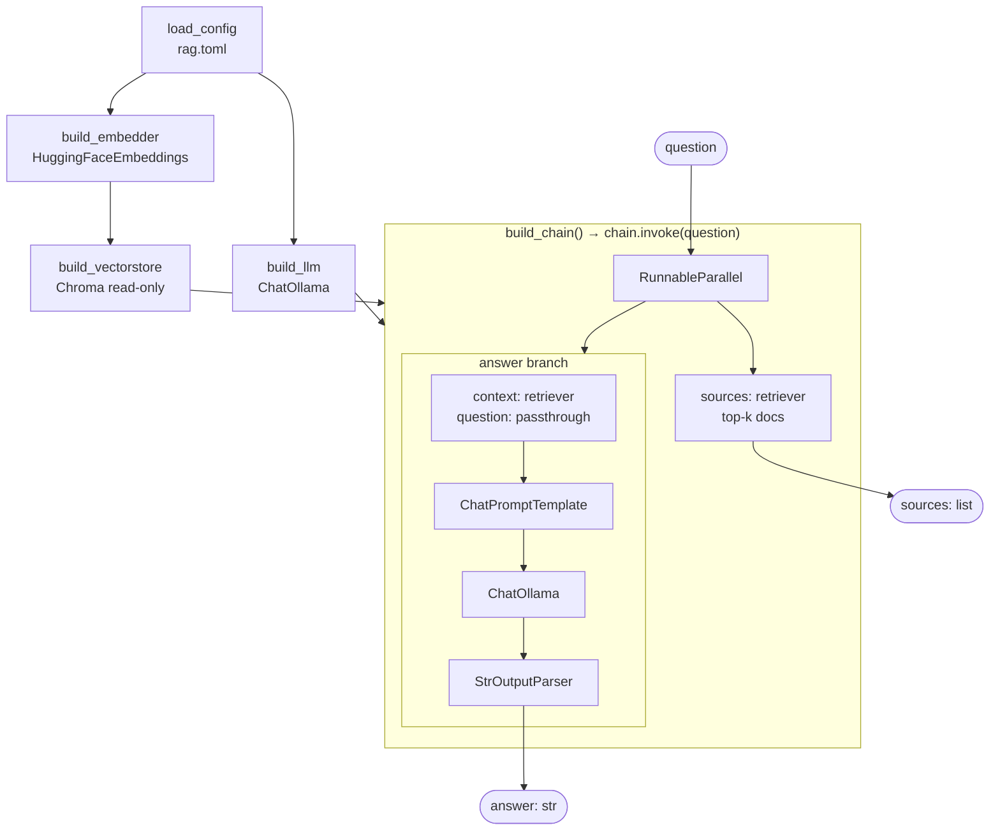

# RAG Pipeline

## Full Pipeline

```mermaid
flowchart TD
    CSV[data_sources.csv]
    DL["downloader.py<br/>fetch each URL"]
    RAW["corpus/raw_data/<br/>.html · .pdf · .csv"]
    INGEST["ingest.py<br/>load → split → embed → store"]
    DB[("ChromaDB<br/>vector_db/")]
    Q["query.py<br/>question → answer"]

    CSV --> DL --> RAW --> INGEST --> DB
    DB --> Q
```

## query.py Internal Flow — Manual Orchestration

```mermaid
flowchart TD
    CFG["load_config<br/>rag.toml"]
    EMB["build_embedder<br/>HuggingFaceEmbeddings"]
    VS["build_vectorstore<br/>Chroma read-only"]
    LLM["build_llm<br/>ChatOllama"]
    Q([question])
    RET["retrieve_chunks<br/>similarity_search top-k"]
    CTX["build_context<br/>join chunk text"]
    PRM["build_prompt<br/>PROMPT_TEMPLATE"]
    ASK["ask_llm<br/>llm.invoke"]
    RES([answer + sources])

    CFG --> EMB --> VS
    CFG --> LLM
    Q --> RET
    VS --> RET
    RET --> CTX --> PRM
    Q --> PRM
    PRM --> ASK
    LLM --> ASK
    ASK --> RES
```

## query.py Internal Flow — LCEL

```mermaid
flowchart TD
    CFG["load_config<br/>rag.toml"]
    EMB["build_embedder<br/>HuggingFaceEmbeddings"]
    VS["build_vectorstore<br/>Chroma read-only"]
    LLM["build_llm<br/>ChatOllama"]
    Q([question])

    subgraph build_chain["build_chain() → chain.invoke(question)"]
        PAR["RunnableParallel"]

        subgraph answer_branch["answer branch"]
            direction LR
            RPAR["context: retriever<br/>question: passthrough"]
            PRM[ChatPromptTemplate]
            OL[ChatOllama]
            STR[StrOutputParser]
            RPAR --> PRM --> OL --> STR
        end

        RET2["sources: retriever<br/>top-k docs"]
    end

    ANS([answer: str])
    SRC([sources: list])

    CFG --> EMB --> VS
    CFG --> LLM
    VS --> build_chain
    LLM --> build_chain
    Q --> PAR
    PAR --> answer_branch
    PAR --> RET2
    STR --> ANS
    RET2 --> SRC
```
