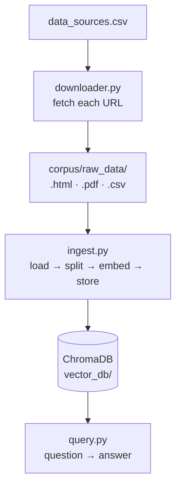
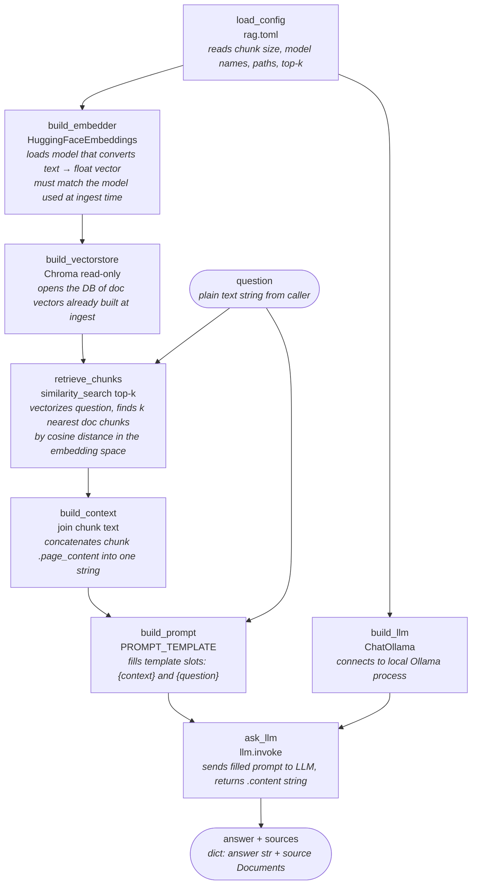

# RAG Pipeline

## Full Pipeline



## Generalized lifecycle

### Ingest

```
documents
↓
chunking
↓
embedding model
↓
vectors
↓
stored in Chroma

```

### query

```
question
↓
same embedding model
↓
query vector
↓
nearest chunks from Chroma
↓
LLM prompt
↓
answer
```

## query.py Internal Flow — Manual Orchestration



## query.py Internal Flow — LCEL


## Huge thing

The embedding model quality often matters MORE than the LLM for RAG quality.

Bad retrieval = bad answers.

Watch for:

- bad chunking
- weak embeddings
- wrong top-k
- noisy documents
- overlap settings
- retrieval strategy
